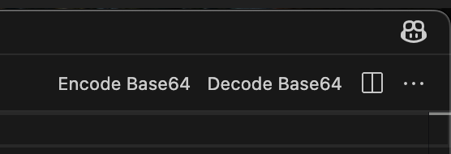

# VSCODE - Base64 Plugin

Due to Sensitive Data: Online encoders cannot be used. Therefore a local encoder has to be used.
Sublime natively, does not come with base64, Notepad ++ only on windows, other thirdparty software, or plugins: We don't trust.

Base64 Encode / Decode Buttons in editor.
Uses MACOS base64 cli tool under the hood.


## Requirements
Node.js 20

## Installation
Under releases download the `base64-vscode-1.0.0.vsix`, VSCode > View > Extensions > Drag it in the window to install. 
1. Install Vscode extension tool
```
npm install -g @vscode/vsce
```
2. Create vs code extension in current dir
```
vsce package
```

3. This creates a `base64-vscode-1.0.0.vsix` extension for vscode.

4. Install extension: Right click > Install Extension VSIX

5. (Optional) Delete local repo and generated extension. Not needed anymore as its installed now.


### Button Location - Top Right Corner


## How to use?
1. File > New Text File
2. Click any of the buttons to decode/encode (No need to select text)
 
 <br><br><br>


## Notes
launch.json used for development, F5 to preview changes.

### ❗Only displays when plain text

Buttons only show when file type is plain text.
To show for any filetype replace:

`"when": "editorLangId == 'plaintext' && editorTextFocus",`

With

`"when": "editorTextFocus",`

 <br><br><br>

 ## 💻 Go full terminal only?

Go to frequently used folder

``cd ~``

### Create files

encode.sh
```
rm input
nano input
base64 < input > output
cat output | pbcopy
```
decode.sh
```
rm output
nano output
base64 -D < output > input
cat input | pbcopy
```

### To encode
1. `sh encode.sh`
2. Paste file in nano editor
3. Control + X
4. y
5. enter

Base64 data is automatically copied to your clipboard. <br>
Paste wherever you want.

Same with decode.sh

Warning: Pasting Large files to nano is slow, maybe use vim instead.
